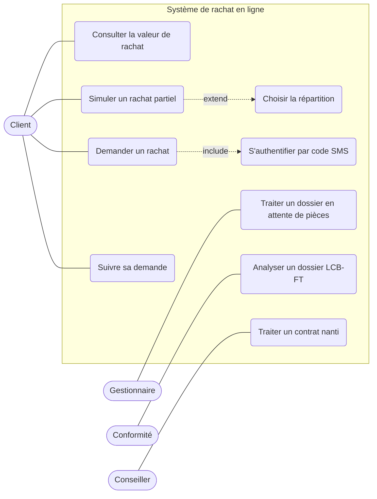
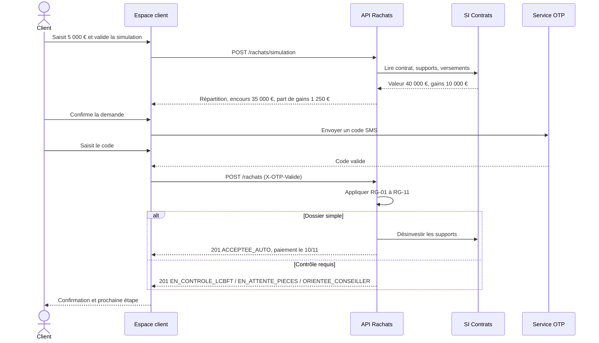
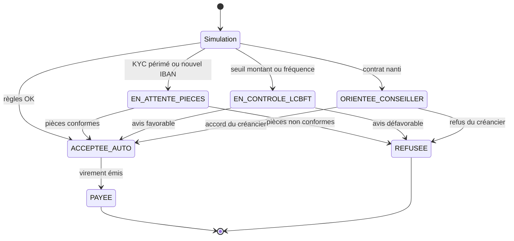
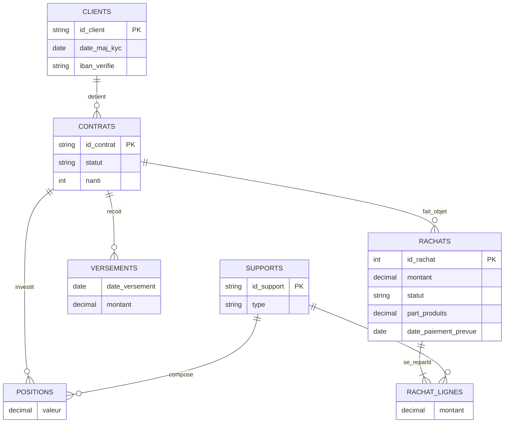

# Modélisation UML

## Diagramme de cas d'utilisation

```mermaid
flowchart LR
    Client([Client])
    Gest([Gestionnaire])
    Conf([Conformité])
    Conseil([Conseiller])

    subgraph Système de rachat en ligne
        UC1(Consulter la valeur de rachat)
        UC2(Simuler un rachat partiel)
        UC3(Choisir la répartition)
        UC4(Demander un rachat)
        UC5(S'authentifier par code SMS)
        UC6(Suivre sa demande)
        UC7(Traiter un dossier en attente de pièces)
        UC8(Analyser un dossier LCB-FT)
        UC9(Traiter un contrat nanti)
    end

    Client --- UC1
    Client --- UC2
    Client --- UC4
    Client --- UC6
    UC2 -. extend .-> UC3
    UC4 -. include .-> UC5
    Gest --- UC7
    Conf --- UC8
    Conseil --- UC9
```

## Diagramme de séquence — demande de rachat

```mermaid
sequenceDiagram
    actor C as Client
    participant F as Espace client
    participant A as API Rachats
    participant S as SI Contrats
    participant O as Service OTP

    C->>F: Saisit 5 000 € et valide la simulation
    F->>A: POST /rachats/simulation
    A->>S: Lire contrat, supports, versements
    S-->>A: Valeur 40 000 €, gains 10 000 €
    A-->>F: Répartition, encours 35 000 €, part de gains 1 250 €
    C->>F: Confirme la demande
    F->>O: Envoyer un code SMS
    C->>F: Saisit le code
    O-->>F: Code valide
    F->>A: POST /rachats (X-OTP-Valide)
    A->>A: Appliquer RG-01 à RG-11
    alt Dossier simple
        A->>S: Désinvestir les supports
        A-->>F: 201 ACCEPTEE_AUTO, paiement le 10/11
    else Contrôle requis
        A-->>F: 201 EN_CONTROLE_LCBFT / EN_ATTENTE_PIECES / ORIENTEE_CONSEILLER
    end
    F-->>C: Confirmation et prochaine étape
```

## Diagramme d'états — cycle de vie d'une demande

```mermaid
stateDiagram-v2
    [*] --> Simulation
    Simulation --> ACCEPTEE_AUTO: règles OK
    Simulation --> EN_ATTENTE_PIECES: KYC périmé ou nouvel IBAN
    Simulation --> EN_CONTROLE_LCBFT: seuil montant ou fréquence
    Simulation --> ORIENTEE_CONSEILLER: contrat nanti
    EN_ATTENTE_PIECES --> ACCEPTEE_AUTO: pièces conformes
    EN_ATTENTE_PIECES --> REFUSEE: pièces non conformes
    EN_CONTROLE_LCBFT --> ACCEPTEE_AUTO: avis favorable
    EN_CONTROLE_LCBFT --> REFUSEE: avis défavorable
    ORIENTEE_CONSEILLER --> ACCEPTEE_AUTO: accord du créancier
    ORIENTEE_CONSEILLER --> REFUSEE: refus du créancier
    ACCEPTEE_AUTO --> PAYEE: virement émis
    PAYEE --> [*]
    REFUSEE --> [*]
```

## Modèle de données

```mermaid
erDiagram
    CLIENTS ||--o{ CONTRATS : detient
    CONTRATS ||--o{ POSITIONS : investit
    SUPPORTS ||--o{ POSITIONS : compose
    CONTRATS ||--o{ VERSEMENTS : recoit
    CONTRATS ||--o{ RACHATS : fait_objet
    RACHATS ||--|{ RACHAT_LIGNES : se_repartit
    SUPPORTS ||--o{ RACHAT_LIGNES : concerne

    CLIENTS { string id_client PK
              date date_maj_kyc
              string iban_verifie }
    CONTRATS { string id_contrat PK
               string statut
               int nanti }
    SUPPORTS { string id_support PK
               string type }
    POSITIONS { decimal valeur }
    VERSEMENTS { date date_versement
                 decimal montant }
    RACHATS { int id_rachat PK
              decimal montant
              string statut
              decimal part_produits
              date date_paiement_prevue }
    RACHAT_LIGNES { decimal montant }
```
